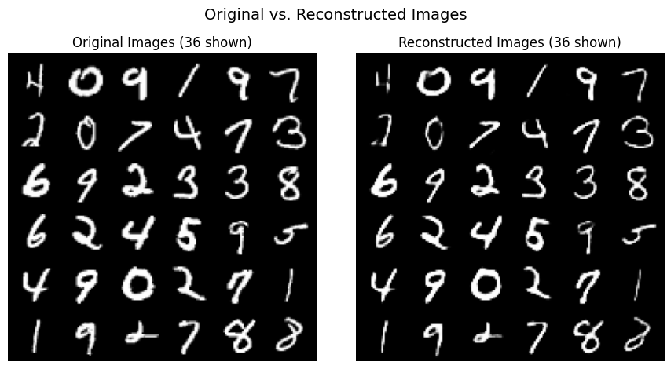

# Autoencoders for MNIST Digit Representation and Generation

This directory contains implementations of Autoencoder models applied to the MNIST handwritten digit dataset.

## About Autoencoders

...

## Implementations

### 1. Standard Autoencoder

Directory: [`Autoencoder/`](./Autoencoder/)

This implementation focuses on a basic Convolutional Autoencoder architecture for MNIST (28x28 grayscale images).

* **Architecture:**
    * The **Encoder** uses a series of `Conv2d` layers with `LeakyReLU` activations and `BatchNorm` to downsample the input image into a compressed latent vector of size `z_dim` (e.g., 32).
    * The **Decoder** uses corresponding `ConvTranspose2d` layers with `ReLU` activations (and a final `Sigmoid`) and `BatchNorm` to reconstruct the image from the latent vector.
* **Training:** The model is trained to minimize the Mean Squared Error (MSE) between the original and reconstructed images using the Adam optimizer.
* **Purpose:** Its primary goal is to learn a compressed representation (encoding) of the MNIST digits and then reconstruct them accurately via the decoder, demonstrating dimensionality reduction and reconstruction.

**Kaggle Notebook:** The implementation and training process can be found in this Kaggle notebook: [Auto Encoder on Kaggle](https://www.kaggle.com/code/mohamedmohiey/auto-encoder)

**Output Example:**

Below is an example showing original MNIST digits alongside their reconstructions produced by the trained Autoencoder after 10 epochs.

*(Image potentially generated by the `visualize_reconstructions`)*

---

### 2. Variational Autoencoder (VAE) - Planned

Directory: [`VAE/`](./VAE/) - *(Implementation Planned)*