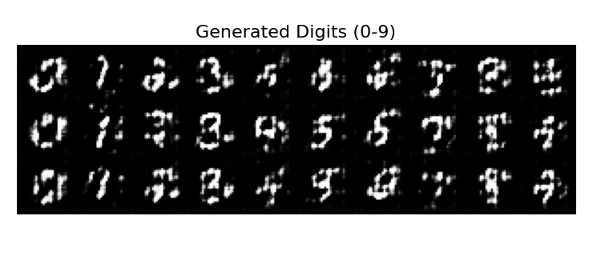

# Handwritten Digit Generation (MNIST)

This repository explores various deep learning techniques for Image Generation, principally using the MNIST dataset. I investigate different architectures within Generative Adversarial Networks (GANs) and Autoencoders.

Below is an example showcasing digits generated by one of the models in this repository:

## Overview

The goal is to implement and compare different generative models capable of producing realistic-looking digit images. The repository is organized into the main approaches used:

* **GANs:** Focuses on adversarial training methods.
* **Autoencoders:** Explores representation learning and generative capabilities through encoding and decoding.

## Methods Explored

### 1. Generative Adversarial Networks (GANs)

Directory: [`GANs/`](./GANS/)

GANs utilize a two-player game between a Generator (creates fake images) and a Discriminator (tries to distinguish real from fake images). Through competition, the Generator learns to produce images indistinguishable from the real dataset.

* **Deep Convolutional GAN (DC-GAN):** Uses convolutional layers for improved stability and image quality.
* **Conditional GAN (cGAN):** Extends GANs to generate images based on a specific condition (e.g., generating a specific digit '7').

See the [`GANs/README.md`](./GANS/README.md) for more details and implementation links.

### 2. Autoencoders

Directory: [`Autoencoders/`](./Autoencoders/)

Autoencoders are unsupervised neural networks typically used for dimensionality reduction or feature learning. They consist of an Encoder (compresses input) and a Decoder (reconstructs input from the compressed representation). Certain variants can also be used generatively.

* **Standard Autoencoder:** A basic implementation focused on reconstructing the input digits after compression.
* **Variational Autoencoder (VAE):** A generative model that learns a probability distribution in the latent space, allowing for the generation of new digit samples.

See the [`Autoencoders/README.md`](./Autoencoders/README.md) for more details.

## Repository Structure

    .
    ├── GANS/
    │   ├── README.md
    │   ├── DC-GAN/
    │   └── Conditional-GAN/
    ├── Autoencoders/
    │   ├── README.md
    │   ├── Autoencoder/
    │   └── VAE/
    └── README.md         # You are here!
