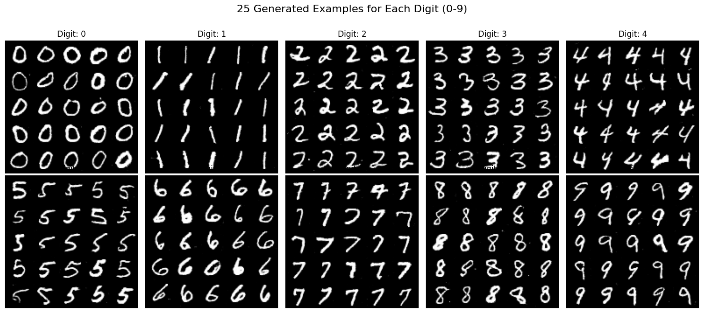

# Handwritten Digit Generation with GANs

This repository explores the generation of handwritten digits (MNIST dataset) using Generative Adversarial Networks (GANs). It includes implementations of different GAN architectures.

## About GANs

Generative Adversarial Networks (GANs) are a powerful class of deep learning models introduced by Ian Goodfellow et al. in 2014. They consist of two neural networks competing against each other:

1.  **Generator (G):** Tries to generate data (in this case, images of digits) that looks realistic, starting from random noise.
2.  **Discriminator (D):** Tries to distinguish between real data (from the actual dataset) and fake data generated by the Generator.

Through this adversarial process, the Generator learns to produce increasingly realistic data, while the Discriminator becomes better at spotting fakes.

## Deep Convolutional GAN (DC-GAN)

Deep Convolutional Generative Adversarial Networks (DC-GANs) represent a key advancement using Convolutional Neural Networks (CNNs) effectively within the GAN framework. DC-GANs achieve more stable training and generate higher-quality images compared to earlier GANs.

**Kaggle Notebook:** Implementation can be found in this Kaggle notebook: [DC-GAN on Kaggle](https://www.kaggle.com/code/mohamedmohiey/dc-gan)

### Implementation Details

*   **Generator:** Takes a latent vector (e.g., 100-dimensional random noise) as input. It uses a series of transpose convolution layers (with BatchNorm and ReLU) to progressively upsample the vector into a 1x28x28 image tensor. The final layer uses a Tanh activation.
*   **Discriminator:** Takes a 1x28x28 image tensor (real or fake) as input. It uses a series of strided convolution layers (often with BatchNorm and LeakyReLU) to downsample the image into feature maps. Finally, these features are typically flattened and passed through a sigmoid activation to produce a single probability score (real vs. fake).
*   **Training:** Uses Binary Cross-Entropy (BCE) loss and often the Adam optimizer for both networks, training them adversarially as described in the general GAN section.

### Output Example

Below is a conceptual placeholder for what generated digits from a trained DC-GAN might look like. Unlike the cGAN, these digits are generated randomly from the noise vector without specific conditioning on a digit label.

*(Image generated by `plot_captured_images` after training)*

---
## Conditional GAN (cGAN)

Conditional Generative Adversarial Network (cGAN) for generating specific handwritten digits (0-9) based on the MNIST dataset. Unlike a standard GAN, a cGAN learns to generate data conditioned on some additional information, typically class labels.

**Kaggle Notebook:** Implementation can be found in this Kaggle notebook: [Conditional GAN on Kaggle](https://www.kaggle.com/code/mohamedmohiey/conditional-gan)

### Concept

The core idea is to provide both the Generator and the Discriminator with the class label (the digit 0-9) as an additional input.

*   **Generator:** Receives random noise *and* a desired digit label. It must learn to generate an image that corresponds to that specific digit.
*   **Discriminator:** Receives an image (either real or fake) *and* its corresponding digit label. It must learn to determine if the image is a realistic example *of that specific digit*.

### Implementation Details

The implementation uses PyTorch and follows common practices for training cGANs on image data.

**Conditioning Mechanism:**

   *   **Label Preparation (`get_one_hot_labels`):** This crucial utility function takes integer labels (0-9) and converts them into two one-hot encoded formats suitable for the networks:
        1.  **Vector (`one_hot_labels_vec`):** Shape `(B, C, 1, 1)`. Used for concatenating with the noise vector for the Generator input.
        2.  **Map (`one_hot_labels_map`):** Shape `(B, C, H, W)`. Created by repeating the vector across spatial dimensions (H, W = 28, 28). Used for concatenating with the image tensor for the Discriminator input.

### Output Example

An example grid showing generated digits (0-9) produced by the trained Conditional GAN after 50 epochs.

*(Image generated by `visualize_all_digits` after training)*